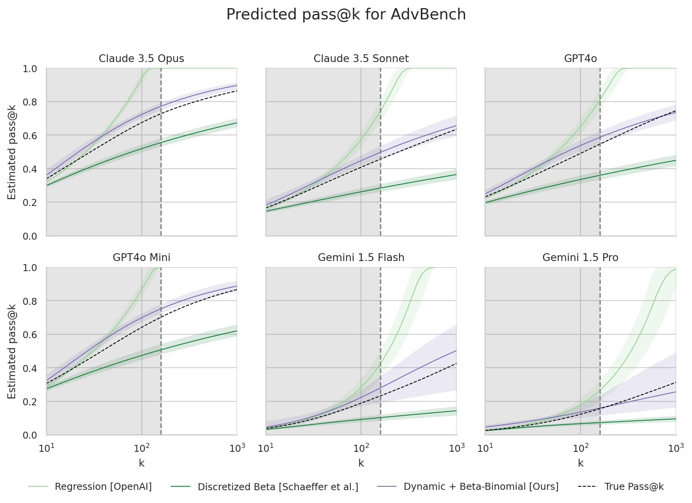

# Efficient Prediction of Pass@k Scaling in LLMs

## Reproducibility Script

1. Build the docker image

`docker build -f experiments/Dockerfile -t experiments .`

2. Run all experiments and generate all plots (2-4 hours).

`docker run --rm -it -v "$PWD:/app" experiments`